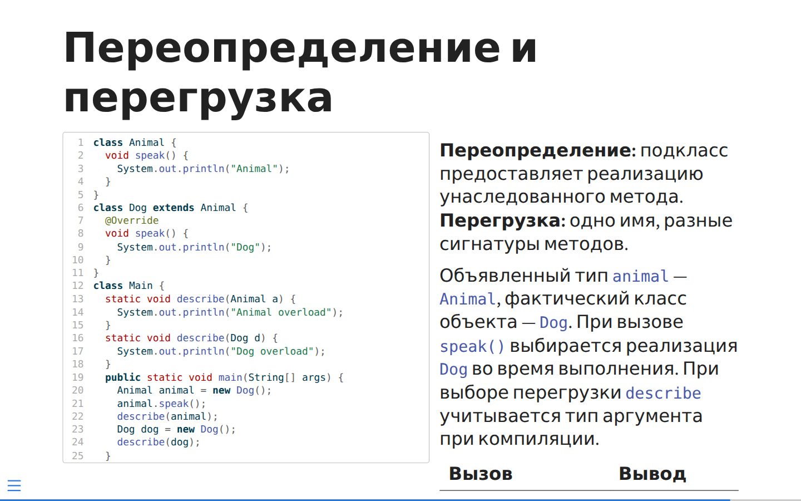
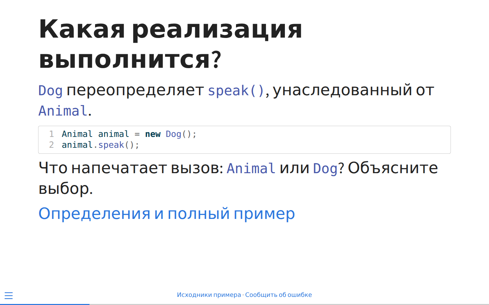
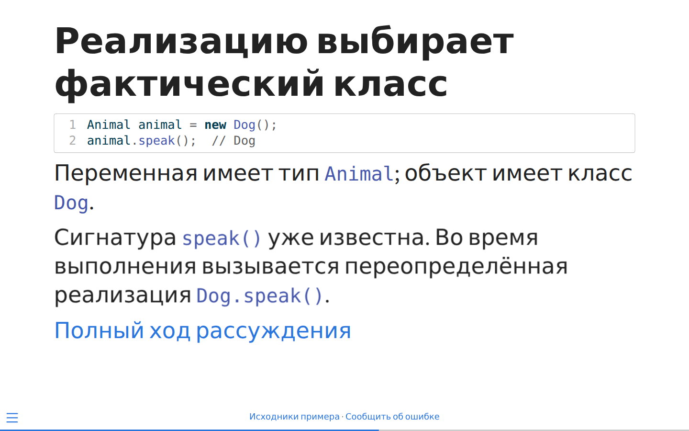
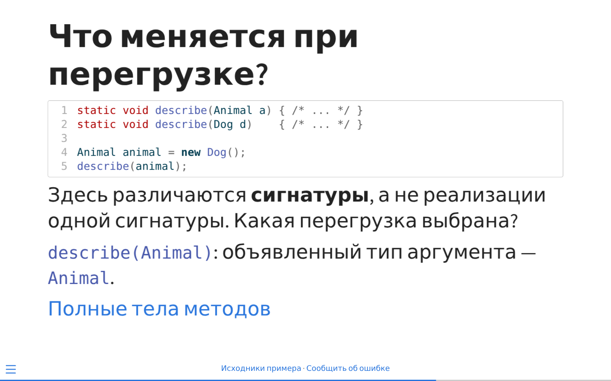
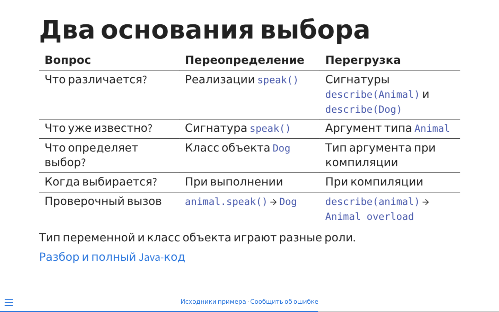
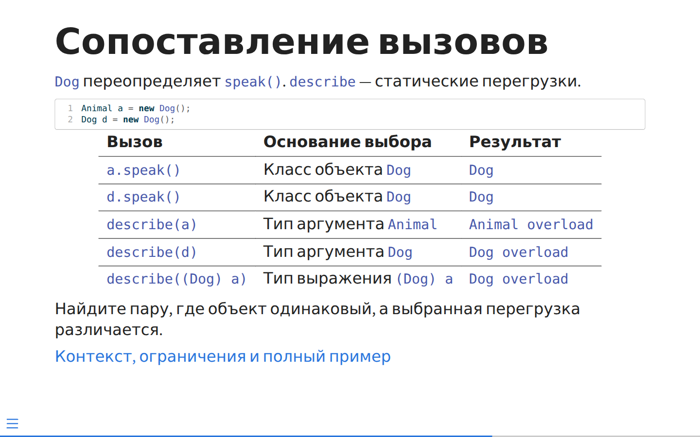

# Руководство по авторской записи курса

Основа — согласованный «План развития общих инструментов Quarto», версия 56,
разделы 1–4 и 7–9. Это руководство описывает принятый авторский маршрут и
отделяет его целевой контракт от возможностей текущей поставки.

**Нативное** ниже означает документированную возможность Quarto/Pandoc,
проверенную в самостоятельных [примерах](../examples/style-guide/README.md)
там, где это указано. **Целевое P0/P1** означает принятое требование,
осуществимость и точную запись которого ещё нужно подтвердить соответствующей
поставкой. Такой пример нельзя считать доказательством новой поддержки Core.
Печатный экспорт и платформенные адаптеры требуют своих последующих проверок.

Текущую реализацию описывают [архитектура расширений](../spec/plugin-architecture.md),
[учебные элементы](../spec/learning-elements.md),
[видимость](../spec/visibility.md), [ссылки](../spec/cross-references.md) и
[представление](presentation.md). Их существующие способы связи через `for`,
наследования метаданных и проверки видимого AST не следует переносить в новый
контракт без адаптации. Для новых требований действует версия 56; это
руководство не меняет код расширений и не объявляет пробы P0/P1 завершёнными.

## Один репозиторий и владельцы материала

Курс содержит пять соседних проектов и общую входную страницу.

| Часть | Что автор пишет здесь | Как связывает с другими частями |
| --- | --- | --- |
| `theory/` | Полное изложение, собственные темы и учебные `exm` | QRC-ссылки на канонические задачи |
| `tasks/` | Все канонические `exr`, включая демонстрации; планы, работы, занятия | QRC-ссылки на подготовку и теорию |
| `practice-slides/` | Ход занятия, вопросы, краткие собственные пояснения | QRC-ссылки на условия задачника |
| `lecture-slides/` | Собственное изложение лекции | QRC-ссылки на теоретическую книгу |
| `reference/` | Подготовка инструментов и инструкции сред | QRC-ссылки на адресуемые материалы |

Корневой `index.qmd` явно ведёт к входам частей. Каждая часть имеет свой
`_quarto.yml`, namespace, output/mount и устойчивого владельца. Корневой
проект не захватывает QMD дочерних проектов в собственный render-set.
Курс выпускается совместно: отдельный render части может быть технической
пробой, но не поддерживаемым независимым выпуском курса. Точную конфигурацию
координатора поставляют инструменты, автор не изобретает второй реестр URL.

Между проектами разрешён только QRC. Не включайте чужой QMD через `include`,
не извлекайте блок по ID и не копируйте условие на практический слайд.
Нативный include остаётся способом организации локального текста внутри
одного проекта. Слайд имеет собственный ID и ссылку на каноническую задачу;
совпадение текста или ID с книгой не связывает их автоматически.

Различайте владельца, namespace представления и транспорт каталога.
Alias, папка, mount, номер слайда и автоматический slug не заменяют
canonical owner/ID. Устойчивый владелец задаётся для каталога книги один раз.
Перенос файла внутри владельца при сохранении явного ID не меняет объект;
перенос объявления в другую книгу меняет его владельца. Нынешний адресный
QRC-каталог и ключ `namespace:id` не доказывают наличие новых семантических
полей owner/revision/profile: их согласованный интерфейс — работа P0/P1.

## Имена, ресурсы и навигация

Пишите русские отображаемые названия и содержательные латинские имена файлов
и явные ID в kebab-case: `method-dispatch.qmd`, `sec-method-dispatch`,
`exm-method-dispatch`. ID отражает смысл и сохраняется при перемещении файла;
он не обязан строго воспроизводить физический путь.

Базовая пара — `topic.qmd` и соседний `topic/` для ресурсов страницы.
Создавайте каталог только когда он нужен. Для другой страницы выделяйте её
собственный каталог; общие изображения и данные помещайте в явно выделенную
область совместного использования. Группируйте пары по смыслу:

| Страница | Её ресурсы |
| --- | --- |
| `theory/models/network.qmd` | `theory/models/network/` |
| `theory/models/linear-programming.qmd` | `theory/models/linear-programming/` |
| `tasks/modeling/route.qmd` | `tasks/modeling/route/` |

Группы исходников не обязаны повторять иерархию тем или меню.
`index.qmd` предназначен для входной страницы проекта; тематические
`main.qmd` и повторяющиеся тематические `index.qmd` не рекомендуются.
Нативные `_quarto.yml` и `_metadata.yml` сохраняют свои имена.
В книге перечисляйте явные содержательные пути:

```yaml
book:
  chapters:
    - index.qmd
    - models/network.qmd
    - models/linear-programming.qmd
```

Проверяйте inventory и `quarto inspect .`, затем готовую навигацию.
Неверное размещение допустимого файла — рекомендация STYLE; копирование
исключённого ресурса в student — отдельная блокирующая VISIBILITY-проверка.
Ни папка, ни `.gitignore`, ни отсутствие ссылки в меню не доказывают приватность.
Инструмент не угадывает принадлежность ресурсов по произвольному коду программы.

## Книга: темы, задачи, подготовка и работы

Полное объяснение пишите в книге. Дайте теме явный устойчивый `sec-*` ID.
Обычные нетематические заголовки не обязаны получать учебную идентичность.
Учебный пример теории оформляйте нативным `exm`, а каноническую задачу —
`exr` в тематическом источнике задачника.

Следующий фрагмент — **целевой контракт P0/P1**, на нативных Div/ID Quarto:

```qmd
## Тема {#sec-topic}

:::: {#exr-topic-example course-role="demonstration" difficulty="introductory"}
Условие демонстрационной задачи.

::: {#sol-topic-example}
Пояснение и ход решения обычным Markdown.
:::
::::
```

У задачи обязательны назначение и сложность. Приняты назначения:
демонстрация, разбор в аудитории, самостоятельное выполнение, контрольная
задача. Точные новые имена значений `course-role` поставляет контракт;
не угадывайте их из русских названий. `demonstration` в примере не означает,
что вся новая семантика уже реализована. Время, форма работы,
характер и environment необязательны. Сложность, время и environment
не наследуются от страницы. Форма `individual/pair/group` не заменяет
назначение, а контрольность не выводится из участия в работе.

Исходная тема задачи — ближайший окружающий тематический заголовок с явным
ID; собственный заголовок упражнения не становится темой.
Другие явно отмеченные тематические ссылки дополняют поиск, но не заменяют
исходную тему и не превращаются в prerequisites. Ссылка из плана или слайда
не изменяет тему, назначение, сложность или подготовку исходной задачи.

Решение связывается точной общей частью ID: `exr-topic-example` /
`sol-topic-example`, либо `exm-topic-example` / `sol-topic-example`.
В целевом контракте один явный `sol-ID`; альтернативные способы решения —
разделы внутри него. Не добавляйте второй `for` или неявную `.solution`.
Область сопоставления — корневой QMD после локальных include.
Orphan sol, одинаковые `exr`/`exm` пути, повтор объявления у одного владельца
и решение в другом самостоятельном QMD — ошибки, а не вопросы стиля.

Подготовка имеет один видимый Markdown-источник, а не дубликат в YAML:

```qmd
## Подтема {#sec-subtopic}

::: {course-role="prerequisites" requirement="required"}
- @theory:sec-topic — что нужно знать.
:::

::: {course-role="prerequisites" requirement="recommended"}
- @reference:sec-tool — полезная подготовка.
:::
```

Это **целевая учебная запись P0/P1** с QRC-ссылками, а не standalone-пример
без подключённых каталогов. Первый адресуемый объект пункта задаёт тему;
последующие ссылки поясняют её. Внутри задачи подготовка принадлежит задаче,
снаружи — окружающей явной теме. Все required нужны совместно.
Задача объединяет подготовку охватывающих тем и собственную: разные
required/recommended для одной темы — конфликт с обоими источниками,
а не победа ближайшего значения. Обычный URL для чтения не создаёт тему.

Сильный граф подготовки тем ацикличен; взаимные рекомендации допустимы.
Иерархия заголовков сама не создаёт prerequisite. Задачи не становятся
узлами карты. Каталог задач содержит ссылки и разрешённые метаданные
канонических опубликованных `exr`, без второй копии условий. Полноту курса,
освоение темы и покрытие результатов такой поиск не доказывает.
Внешние источники выбираются явно; недостающая required или recommended
цель не исчезает молча. Гарантии относятся к этому конечному набору снимков.

План в задачнике — явно отмеченная таблица/список с назначающими ссылками и
`required/recommended/optional` у включения. Это **целевой контракт P1**;
точную запись контейнера и отметки поставляет контракт. Не распознавайте
колонки по русским названиям. Повтор включения задачи в один план — ошибка,
даже при одинаковой обязательности. В другом плане та же задача может быть
recommended. Отсутствие включения ничего не назначает; обычная поясняющая
ссылка не становится включением.

Одна оцениваемая работа занимает одну QMD-страницу, имеет явный устойчивый
ID первого заголовка и фиксированный состав, одну итоговую оценку.
Существующий извлекатель Assessment — основа адаптации, но не доказательство
гарантий явного ID/владельца. Пример **целевой записи P1**:

```qmd
---
assessment:
  kind: lab
---

# Работа {#sec-work-topic}

::: {.assessment-items}
1. @exr-topic-first
2. @exr-topic-second
:::
```

Не повторяйте состав в адаптерной конфигурации `assessments`.
Другая аудитория с другим составом получает другую работу, а не поднабор
одной работы из плана. Подготовка отделяется от проверяемого состава;
контрольная ссылается на явно контрольные задачи.

## Состав student/full и ответы

Все исходники курса намеренно находятся в открытом репозитории, включая
full-части. Full-only означает исключение из производного student-выпуска
и управляемого student-пакета, а не секретность Git или его истории.

| Материал в целевом контракте | Student | Full |
| --- | --- | --- |
| Обычное условие `exr` | Есть | Есть |
| Контрольное условие и служебные материалы | Нет | Есть |
| `sol` обычной задачи | Нет | Есть |
| `sol` демонстрации / учебное пояснение `exm` | Есть | Есть |
| `grading-notes`, машинный ключ, отметки правильности | Нет | Есть |

Ограничение окружающего блока сильнее видимости вложенного материала.
Публичный пример может объяснять ответ, но это не разрешает выдавать его
машинный ключ или grading-notes. Полную исходную модель проверяют до проекции.
Контрольный состав исключается из student вместе с семантическими включениями;
обычная авторская ссылка на исключённое условие/sol — ошибка целостности.
Перенесите текст в разрешённый контекст или измените ссылку: инструмент
не переписывает абзац автоматически.

Проверяйте HTML, слайды, поиск, JSON-каталоги, ресурсы, PDF и выбранные ZIP.
CSS, fragments и сворачивание не удаляют содержимое.
Намеренный переход к открытому source/issue допустим и не становится
учебной ссылкой на отсутствующую student-цель.

Markdown-решение остаётся базовым форматом. Машинный ключ, структура ответа
и LMS необязательны. Способ ручной сдачи текста/файла описывайте рядом с
условием; отсутствие ключа само по себе не определяет сдачу.

**Принятый проект P0/P1, не готовый API:** один невыполняемый локальный
`.answer-spec` CodeBlock внутри exr с обычным YAML. Например:

````qmd
```{.yaml .answer-spec}
type: numeric
key:
  value: 12.5
  tolerance:
    absolute: 0.1
```
````

Не публикуйте такой фрагмент обычным Quarto без соответствующего модуля:
сырой YAML показал бы ключ. Общий модуль должен разобрать/проверить данные,
создать публичный AST и отделить ключ до проекции, даже без LMS.
Multipart вводится только для отдельных inputs; matching имеет один полный
публичный банк и закрытые пары. Нет второго ручного банка или ключа,
извлечённого из свободного текста sol. Точные схемы и переносимость требуют
проб; богатые/повторяющиеся подписи и ограничения повторного выбора
не объявлены поддержанными. Сейчас дорисовка — ручная, не универсальный
редактор или распознаватель.

В целевом курсе default — student, а каждый member предоставляет
`_quarto-student.yml` и `_quarto-full.yml`, при необходимости с пустыми
метаданными. Ожидаемые имена профилей проверяются явно: нативный Quarto
может проигнорировать неизвестное имя. Student/full outputs и внутренний
snapshot разделяются. Не считайте успешный старый preview результатом
новой неуспешной сборки.

## Презентация: видимая мысль и публичные заметки

Используйте нативный `revealjs` HTML. Основной тезис, нужный для рассуждения
код/схема и основной переход находятся на соответствующем слайде.
Рядом с иллюстрацией/существенным утверждением помещайте краткую атрибуцию;
длинную библиографию можно дать в конце. Ссылке дайте смысловое название.
QR-код дополняет обычную ссылку. Между частями курса используйте QRC,
в том числе внутри notes.

````qmd
---
format:
  revealjs:
    show-notes: false
---

## Реализацию выбирает фактический класс {#sec-runtime-dispatch}

```java
Animal animal = new Dog();
animal.speak();
```

Полный разбор в книге: @theory:sec-runtime-dispatch.

::: {.notes}
Попросить предсказать реализацию и обосновать выбор.
:::
````

Div notes и настройка Reveal нативны. Ссылка `@theory:...` требует
реального подключённого QRC-каталога; имя/ID здесь условные.

Обычные `.notes` публичны и остаются в HTML при `show-notes: false`.
Speaker View открывается клавишей `S`. Notes кратко помогают вести обсуждение,
полное изложение находится в книге. Дополнительный переход может быть в notes,
но обязательный маршрут к теме, задаче, файлу или раздатке виден на слайде.
Параметр Quarto — `show-notes`; собственный `speaker-notes` DSL не нужен.
Full-only материал не помещают в student notes/fragments.
При необходимости штатный `.content-visible when-profile="full"` ограничивает
фрагмент по профилю; это не скрывает исходник открытого Git и не заменяет
проверку всех артефактов. Notes и grading-notes имеют разный смысл.

Строгий вариант **7А**: читаемость и композицию оценивают по готовому слайду
и учебной цели. Нет автоматических STYLE-предупреждений по числу слов,
пунктов, строк кода, формул или колонок, нет плотностных порогов.
Одна основная мысль — педагогический ориентир. Плотное сопоставление может
быть полезнее короткого слайда, если связанные элементы видны вместе.

### Сквозной пример: до → разбор → после

Аудитория уже знает ссылочные переменные, наследование, `new` и сигнатуру
метода. Первый вывод: объявленный тип переменной и фактический класс объекта
отвечают на разные вопросы при вызове переопределённого метода.
Сопоставление с перегрузкой — следующий осмысленный шаг, после этого вывода.

Исходный слайд содержит полные классы, длинный `main`, определения, таблицу
результатов и вопрос одновременно. [Полная QMD-запись «до»](../examples/style-guide/java-before.qmd)
использует штатные `.columns` и `.smaller`; её снимок показывает фактический
render, а не макет:

<details>
<summary>Полная авторская QMD-запись «до»</summary>

````qmd
---
title: "До: конкурирующие задачи чтения"
format:
  revealjs:
    theme: default
    slide-level: 2
    show-notes: false
    transition: none
---

## Переопределение и перегрузка {#sec-java-before .smaller}

:::: {.columns}
::: {.column width="55%"}
```java
class Animal {
  void speak() {
    System.out.println("Animal");
  }
}
class Dog extends Animal {
  @Override
  void speak() {
    System.out.println("Dog");
  }
}
class Main {
  static void describe(Animal a) {
    System.out.println("Animal overload");
  }
  static void describe(Dog d) {
    System.out.println("Dog overload");
  }
  public static void main(String[] args) {
    Animal animal = new Dog();
    animal.speak();
    describe(animal);
    Dog dog = new Dog();
    describe(dog);
  }
}
```
:::
::: {.column width="45%"}
**Переопределение:** подкласс предоставляет реализацию унаследованного метода.
**Перегрузка:** одно имя, разные сигнатуры методов.

Объявленный тип `animal` — `Animal`, фактический класс объекта — `Dog`.
При вызове `speak()` выбирается реализация `Dog` во время выполнения.
При выборе перегрузки `describe` учитывается тип аргумента при компиляции.

| Вызов | Вывод |
| --- | --- |
| `animal.speak()` | `Dog` |
| `describe(animal)` | `Animal overload` |
| `describe(dog)` | `Dog overload` |

Предскажите результат, найдите определения и сравните механизмы.

[Полный разбор](java-dispatch.html#sec-java-dispatch)
:::
::::

::: {.notes}
Этот намеренно неудачный слайд служит материалом разбора композиции.
:::
````

</details>



Читатель одновременно ищет переопределённый метод в классах, читает main,
усваивает новые определения и сопоставляет результаты. Готовая таблица
раскрывает ответ раньше прогноза, а пространственно разнесённые объявления
заставляют переключаться между сигнатурами и вызовами. Даже уменьшение шрифта
или перенос формального определения в notes не устраняет конкуренцию целей.
В этом render нижняя часть таблицы и основной переход также ушли за границу
кадра: правильная ссылка в исходнике ещё не делает её доступной при показе.

Переработка оставляет существенные данные рядом с вопросом. Полные тела
классов переходят в [полное изложение](../examples/style-guide/java-dispatch.qmd),
а слайды пишутся самостоятельно. Локальная ссылка runnable-примера соединяет
документы одного проекта; в курсе на её месте будет QRC-ссылка на теорию.
[Полная QMD-запись «после»](../examples/style-guide/java-after.qmd) содержит
следующие шаги:

| Шаг | Что остаётся видно | Зачем этот переход |
| --- | --- | --- |
| Прогноз | `Animal animal = new Dog(); animal.speak();`, факт переопределения и вопрос | Рассуждение возможно без поиска классов и без готового ответа |
| Объяснение | Тот же вызов с `Dog`, оба основания типа и fragment с объяснением | Сохраняется зрительная опора; объяснение появляется после обсуждения |
| Перегрузка | Обе сигнатуры `describe`, аргумент `animal`, вопрос и fragment | Вводится отдельный выбор сигнатуры по типу аргумента |
| Сопоставление | Общая таблица механизмов, основания и проверочные вызовы | Связанные признаки уже знакомы и полезно видеть их одновременно |









Вот достаточная для объяснения QMD-запись второго шага:

````qmd
## Реализацию выбирает фактический класс {#sec-java-explanation}

```java
Animal animal = new Dog();
animal.speak();  // Dog
```

Переменная имеет тип `Animal`; объект имеет класс `Dog`.

::: {.fragment}
Сигнатура `speak()` уже известна. Во время выполнения вызывается
переопределённая реализация `Dog.speak()`.
:::

[Полный ход рассуждения](java-dispatch.html#sec-java-dispatch)

::: {.notes}
Повторить обоснование аудитории и открыть fragment.
Не говорить, что любой выбор метода происходит во время выполнения.
:::
````

Fragment меняет момент показа, а не состав HTML. Основная ссылка постоянно
видна. Публичная notes помогает ведущему выбрать вопрос и переход, не служит
скрытым хранилищем ответа. В книге остаются определения, завершённый `Main`,
ожидаемый вывод, ограничения примера и нормативные ссылки JLS.
Теперь легче увидеть соответствие `Animal` в объявлении и `Dog` в создании;
для полного кода нужен переход в книгу. Число слайдов здесь — результат
конкретной учебной последовательности, не правило для других тем.

### Контрпример к механической плотности

[Плотное поле сравнения](../examples/style-guide/dense-comparison.qmd) намеренно
содержит несколько случаев, основания и результаты на одном слайде:



Задача — найти случаи с одинаковым объектом и разной выбранной перегрузкой.
Повтор структуры строк помогает сравнивать, а общий столбец основания
связывает результат с кодом. Разбиение таблицы заставило бы держать предыдущий
случай в памяти. Для уже знакомых механизмов эта композиция уместна;
для первого знакомства она потребует другого введения.

Короткий слайд «Полиморфизм / перегрузка / Animal / Dog» без явных связей
содержал бы меньше текста, но хуже объяснял бы выбор. Проверяйте, читается ли
код в условиях показа, видна ли связь вызова и основания, помогает ли совместное
размещение нужному сравнению. Нельзя вывести качество из подсчёта элементов.

### Печать и действия репозитория

Для слайдов — HTML и штатный Print View через меню Reveal или `?print-pdf`.
Студент может сам выбрать «Печать → Сохранить как PDF» в браузере.
Отдельный PDF слайдов не материализуется и не хранится как артефакт курса;
Beamer не используется. При `show-notes: false` notes обычно не включаются
в печать, но это оформление, а не ограничение чтения HTML.

У HTML-книги используйте нативные действия Quarto:

```yaml
book:
  repo-url: https://github.com/ORG/COURSE
  repo-branch: main
  repo-subdir: theory
  repo-actions: [source, issue]
```

Подставьте реальную ветку и каталог проекта; у книг общий repo-url, разные
repo-subdir. Корневой сайт использует `website` вместо `book`.
Source открывает текущую авторскую страницу, включая её full-части.
После QRC-перехода читатель находится у владельца, его repo-actions ведут
к его исходнику. QRC не получает отдельный source-map или реестр repo-actions.
Для локального include/inline нельзя обещать точный фрагмент или вести
читателя в generated staging.

У Reveal используйте штатный `footer`/`.footer` с обычными ссылками,
как в runnable-примере. Наличие repo-actions у книги не обещает такой же UI
у слайдов. Автоматическое вычисление source пути текущего QMD не заявляется.
Проверяйте реальные href в выбранной теме, после QRC finalize, под URL-префиксом
и в нужных профилях. Отправлять issue для проверки ссылки не требуется.

## Бланк и выбранные адаптеры

Это **целевой маршрут**, не готовый печатный API. Раздатка — краткая страница
занятия задачника: собственные опорные тезисы, QRC-ссылки на теорию/слайды и
явный выбор местных канонических задач. Не печатайте всю главу как раздатку,
не копируйте чужую книгу. Проект `.print-items` — список выбора, отличающийся
от состава оцениваемой работы `.assessment-items`:

```qmd
::: {.print-items}
1. @exr-topic-first
2. @exr-topic-second
:::
```

Этот маркер ещё не реализован. Обычная ссылка не означает включение условия
в PDF. В выбранном PDF условия берутся из проверенного bundle того же
владельца, а не из чужого QMD или готового HTML. QRC разрешает адреса,
не переносит тела задач. Rich inline с фигурами, формулами, сносками,
библиографией, локальными ссылками и ресурсами требует bounded probes;
общая переносимость Pandoc/Quarto nodes пока не доказана.

Бланк позволяет выполнить работу строго на бумаге. Внутри находятся нужные
условия/рисунки и области ответа, включая ручную дорисовку. Если выбранное
программное/file/widget-задание нельзя выразить так, адаптер выдаёт ADAPTER,
не превращает его автоматически в письменное. Полноту условий обеспечивает
автор. Шапка индивидуальная: тема из главного явного заголовка, поля
«Дата», «Группа», «ФИО» по умолчанию пустые. Нет даты сборки как даты занятия,
персональных вариантов, командных шапок или ответа на отдельных листах.

PDF выбранных задач исключает sol/key/grading-notes и отметки правильности,
включая публичные demo-sol; варианты ответа остаются. Контрольный PDF
получает отдельную явно заданную доставку, не входит автоматически в student.
В full web преподаватель видит выбранные задачи и читаемые ответы;
`presentation.full.task-display: inline | links` — проект настройки
повторения условий, не новая visibility и не универсальный inline всех ссылок.
Для PDF всегда нужны условия и поля независимо от этого web-режима.

Печатный адаптер материализует текущий PDF при сборке; остаётся только
актуальный результат, без архива и преподавательского PDF с ответами.
Производные PDF/.typ/AST/staging не коммитятся в исходный Git.
Печатный шаблон, шрифты, поля и редкие размеры областей принадлежат адаптеру,
не обязательным атрибутам каждой задачи. Адресный preview — черновой просмотр,
не независимый выпуск части курса. Быстрый cache/preview и время правки
ещё требуют реализации и замеров; старый результат после ошибки не новый.

LMS-адаптеры выбираются явно. Приём, баллы, попытки, grader, delivery и
внешние IDs относятся к выбранной платформе и конфигурации `assessments`.
Самостоятельная допустимая Markdown-книга не требует Moodle/PrairieLearn.
Совместимость экспортного формата не заменяет фактические import/load,
submissions и student-view проверки целевой установки. Неподдержанный
выбранный экспорт — ADAPTER с QMD/ID, без молчаливого пропуска задачи.
Ресурсы извлекаются штатными AST-механизмами, невидимые зависимости объявляются
явно. Project-download упаковывает разрешённый набор, не определяет его
учебную видимость и не рендерит PDF.

## Проверки, предупреждения и подсказки

**Целевая политика диагностики:** ошибки SOURCE/CORE/REF/GRAPH/VISIBILITY
блокируют соответствующую стадию/выпуск. BUILD сохраняет причину renderer;
ADAPTER относится к выбранному экспорту; INTERNAL — к инструменту.
REF.CATALOG_UNAVAILABLE отличается от неизвестной цели. COMPAT сообщает
фактический результат своей выбранной проверки, а не успешность книги.

Минимально сообщение указывает подтверждённый входной QMD/конфигурацию,
доступный ID/поле, код, причину и полезный hint. Для конфликта нужны обе
записи, для цикла — цепочка. Строки, колонки и исходный include-фрагмент
выводятся только при подтверждённых данных; точный source map не обещан.

```text
error CORE.PLAN_DUPLICATE: задача повторно включена в план
  источник: tasks/plans/specialty-a.qmd, план plan-a, ссылка exr-topic-example
  note: первое включение — другая исходная запись того же плана
  hint: удалите одно назначающее включение; поясняющая ссылка допустима
```

Это схематический **целевой** формат, не вывод уже поставленной команды.
Hint объясняет конкретную ошибку, не создаёт дополнительное правило стиля.
STYLE — отдельный канал предупреждений, STYLE-only даёт exit 0 и допустимый
выпуск. Сбой линтера не выдаётся за успешную проверку. Не подавляйте общий
stderr Quarto: его native warnings имеют собственную политику. Текущий
внутренний render Core с `--fail-if-warnings` означает, что STYLE нельзя
просто отправить в него через `quarto.log.warning`.

Следующие имена — **предлагаемые коды руководства**, не реализованные правила.
Тематическая поставка закрепляет небольшой реестр и проверенный набор;
не объявляйте его существующим checker.

| Рекомендация и пример | Область | Проверка / статус | Код STYLE проекта |
| --- | --- | --- | --- |
| Содержательные Latin kebab-case файлы/ID: `network.qmd`, `sec-network` | Авторские файлы и явные ID; native служебные имена сохраняются | Inventory / уже извлечённая модель; будущая warning | `STYLE.NAME` |
| `index.qmd` только на входе; глава `models/network.qmd` вместо `main.qmd` | Входы и главы проекта | Inventory и Quarto inspect; будущая warning | `STYLE.ENTRY_FILE` |
| `topic.qmd` рядом с `topic/`; общий материал явно выделен | Организация ресурсов и исходников | Inventory без угадывания кода; будущая warning | `STYLE.RESOURCES` |
| Смысловые группы пар, например `models/` и `modeling/` | Большие каталоги курса | Ручная ревизия; автоматическое распознавание смысла не заявлено | Нет автоматического кода |
| Последовательная запись Markdown по малому проверенному набору | Поддержанные конструкции QMD | Готовый markdownlint-cli2, warning-only; набор ещё требуется проверить | `STYLE.MARKDOWN` |
| Читаемые слайды, существенный переход рядом с задачей | Готовый render и учебная цель | Ручная проверка 7А; без подсчётов и плотностных warnings | Нет автоматического кода |

Структурные проверки используют Quarto AST/inspect/извлечённую модель,
а Markdown-линтер не заменяет Pandoc, Core или QRC. Собственный parser,
formatter и автоисправления не вводятся. Доступность ссылочной цели относится
к REF/VISIBILITY; педагогическая уместность размещения корректной ссылки —
ручная оценка, не скрытый compiler hint.

Для целевого совместного курса обычный маршрут:

```sh
quarto inspect .
quarto render --profile student
quarto preview --profile student
quarto render --profile full
```

Он предполагает установленные расширения и координатор соответствующей
поставки. Команды не объявляют существование нового быстрого checker:
его интерфейс поставляется в P1. Для native-примеров этого руководства
достаточно `quarto render` из `examples/style-guide/`.
Проверяйте готовый слайд/страницу, ссылки и актуальность после ошибки;
freeze/cache не отменяют семантическую проверку. Финальный выпуск проверяется
чистой сборкой реально установленной потребительской копии.

Нативные опорные документы: [Reveal Basics](https://quarto.org/docs/presentations/revealjs/),
[Fragments](https://quarto.org/docs/presentations/revealjs/advanced.html#fragments),
[Speaker View и Print to PDF](https://quarto.org/docs/presentations/revealjs/presenting.html),
[Reveal options](https://quarto.org/docs/reference/formats/presentations/revealjs.html),
[действия репозитория HTML-книги](https://quarto.org/docs/books/book-output.html#sidebar-tools),
[профили](https://quarto.org/docs/projects/profiles.html) и
[условное содержимое](https://quarto.org/docs/authoring/conditional.html).
